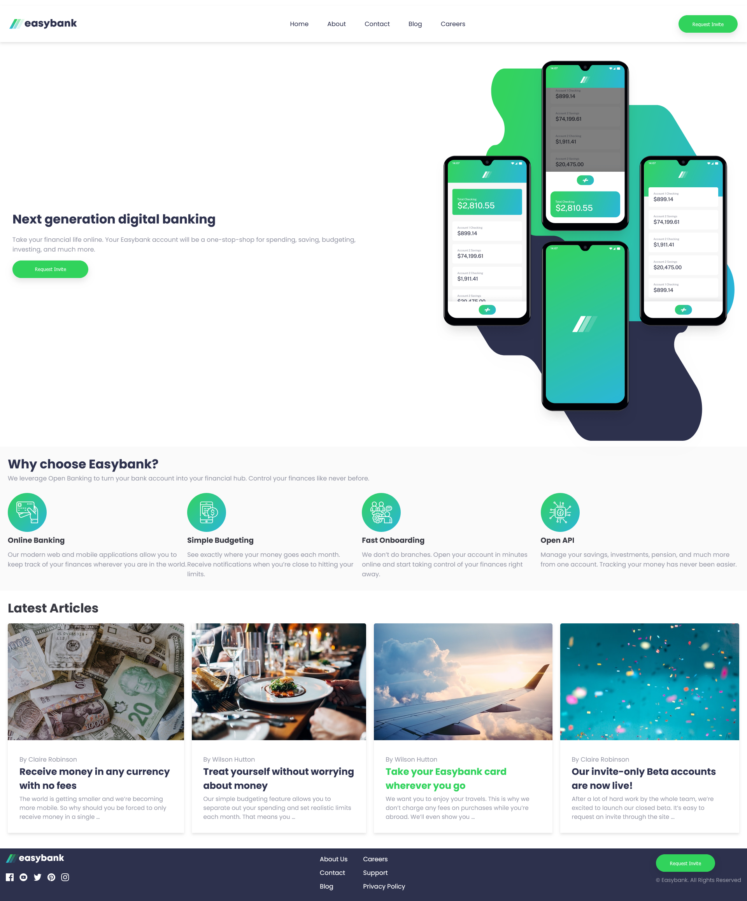
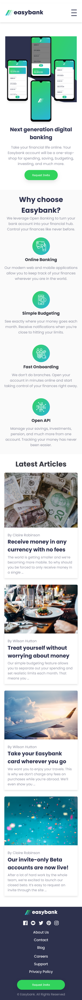

# Frontend Mentor - Easybank landing page solution

This is a solution to the [Easybank landing page challenge on Frontend Mentor](https://www.frontendmentor.io/challenges/easybank-landing-page-WaUhkoDN). Frontend Mentor challenges help you improve your coding skills by building realistic projects. 

## Table of contents

- [Overview](#overview)
  - [The challenge](#the-challenge)
  - [Screenshot](#screenshot)
  - [Links](#links)
- [My process](#my-process)
  - [Built with](#built-with)
  - [What I learned](#what-i-learned)
  - [Continued development](#continued-development)
  - [Useful resources](#useful-resources)
- [Author](#author)

## Overview

### The challenge

Users should be able to:

- View the optimal layout for the site depending on their device's screen size
- See hover states for all interactive elements on the page

### Screenshot





### Links

- Solution URL: [Add solution URL here](https://your-solution-url.com)
- Live Site URL: [Add live site URL here](https://your-live-site-url.com)

## My process

### Built with

- Semantic HTML5 markup
- CSS custom properties
- CSS keyframe animations
- Flexbox
- Desktop-first workflow

### What I learned

By following the instructions of a web tutorial on how to implement a keyframe animation to make an X for the mobile was very helpful and useful which makes the website a more interesting page on the mobile.

```css
  .hamburger.active .bar {
    background-color: hsl(136, 65%, 51%);
  }

  .hamburger.active .bar:nth-child(1) {
    transform: rotate(45deg) translate(9px, 9px);
  }

  .hamburger.active .bar:nth-child(2) {
    opacity: 0;
  }

  .hamburger.active .bar:nth-child(3) {
    transform: rotate(-45deg) translate(9px, -9px);
  }

  @keyframes dropdown {
    0% {
      opacity: 0;
      transform: translateY(-20px);
    }

    100% {
      opacity: 1;
      transform: translateY(0);
    }
  }
```

### Continued development

The only continued development that is needed for this project is a way to display the main image below the navigation bar 
and have it displayed properly as shown in the designs without breaking the page entirely. This is something that will need to be learned and eventually fixed.

### Useful resources

- [CSS Flexbox](https://css-tricks.com/snippets/css/a-guide-to-flexbox/) - This helped me for displaying the article list within a flexbox. This a design pattern I am planning to consider/use in the future.
- [CSS Keyframes Animation](https://www.joshwcomeau.com/animation/keyframe-animations/) - This is a great article which helped me understand Keyframe Animation as a total beginner. I highly recommend it so it can be used in othe projects if you need a loading spinner.

## Author

- Website - [Joshua Campbell](https://www.joshua-campbell.net/)
- Frontend Mentor - [@yourusername](https://www.frontendmentor.io/profile/jcampb98)
- LinkedIn - [Joshua Campbell](https://www.linkedin.com/in/joshua-campbell98/)